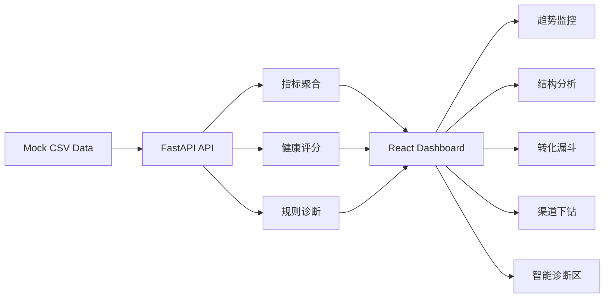

# 技术架构说明

## 1. 架构目标

本项目的技术设计目标不是追求复杂，而是保证以下三点：

- Demo 可以在本地快速启动和展示
- 代码结构足够清晰，后续可继续扩展
- 能真实表达一个经营分析看板从数据层到展示层的链路

## 2. 总体架构



### 分层说明

- 数据层：使用 CSV 模拟经营数据明细
- 服务层：FastAPI 提供统一接口，Pandas 完成聚合与衍生指标计算
- 展示层：React + Ant Design + ECharts 负责工作台式可视化展示
- 诊断层：基于规则引擎生成智能洞察、优先级和阈值监控

## 3. 前端设计

前端位于 `frontend/`，采用 React + TypeScript + Vite。

### 前端职责

- 承载经营分析工作台页面
- 负责图表渲染、模块布局和交互状态
- 将后端返回的数据组织为 KPI、趋势、结构、漏斗、下钻和诊断区

### 主要目录

```text
frontend/
├── src/
│   ├── components/
│   │   ├── MetricCard.tsx
│   │   ├── ModuleCard.tsx
│   │   └── SectionHeader.tsx
│   ├── pages/
│   │   └── DashboardPage.tsx
│   ├── services/
│   │   └── dashboard.ts
│   ├── App.tsx
│   ├── main.tsx
│   └── index.css
├── package.json
└── vite.config.ts
```

### 关键实现点

- `ModuleCard.tsx`：统一模块容器、维度切换和拖拽入口
- `MetricCard.tsx`：统一 KPI 卡片样式与异常高亮
- `DashboardPage.tsx`：页面状态、图表配置、联动逻辑、智能诊断展示
- `dashboard.ts`：封装前端 API 调用

### 前端交互特点

- 日 / 周 / 月切换
- 模块独立筛选
- KPI 与趋势模块联动
- 智能洞察与模块联动
- 模块拖拽换位 Demo

## 4. 后端设计

后端位于 `backend/`，采用 FastAPI + Pandas。

### 后端职责

- 读取和清洗 CSV 数据
- 聚合指标并构建前端需要的结构化响应
- 计算健康指数、评分拆解、异常列表和规则洞察

### 主要目录

```text
backend/
├── app/
│   ├── main.py
│   ├── routers/
│   │   └── metrics.py
│   └── services/
│       └── metrics_service.py
└── requirements.txt
```

### 核心文件说明

- `main.py`：应用入口、CORS、路由挂载、健康检查
- `metrics.py`：API 路由定义
- `metrics_service.py`：数据加载、指标计算、评分逻辑、洞察生成

## 5. 数据模型

原始数据文件：`data/mock_metrics.csv`

### 原始字段

| 字段 | 含义 |
| --- | --- |
| `date` | 日期 |
| `channel` | 渠道 |
| `region` | 区域 |
| `visits` | 访问量 |
| `active_users` | 活跃用户数 |
| `registrations` | 注册数 |
| `activated_users` | 激活用户数 |
| `paying_users` | 付费用户数 |
| `revenue` | 收入 |
| `refund_amount` | 退款金额 |
| `support_tickets` | 工单量 |
| `nps` | 净推荐值 |
| `cost` | 投入成本 |

### 衍生字段

| 字段 | 计算方式 |
| --- | --- |
| `net_revenue` | `revenue - refund_amount` |
| `conversion_rate` | `paying_users / active_users` |
| `activation_rate` | `activated_users / registrations` |
| `refund_rate` | `refund_amount / revenue` |
| `arpu` | `net_revenue / active_users` |
| `roi` | `net_revenue / cost` |
| `cac` | `cost / registrations` |
| `service_health` | `nps - ticket_pressure * 0.45` |

## 6. API 设计

### `GET /api/overview`

返回首页总览数据：

- KPI 卡片
- 预警信息
- 健康指数
- 评分解读
- 评分拆解

### `GET /api/trend`

参数：

- `metric`: `net_revenue | active_users | conversion_rate | activation_rate | refund_rate`
- `granularity`: `day | week | month`

用途：

- 生成趋势监控曲线

### `GET /api/funnel`

参数：

- `granularity`: `day | week | month`

用途：

- 返回访问、注册、激活、付费四阶段漏斗数据

### `GET /api/structure`

参数：

- `granularity`: `day | week | month`

用途：

- 返回渠道结构和区域效率信息

### `GET /api/drilldown`

参数：

- `granularity`: `day | week | month`

用途：

- 返回渠道级收入、ROI、退款率和风险标签

### `GET /api/insights`

参数：

- `granularity`: `day | week | month`

用途：

- 返回规则驱动的智能洞察

### `GET /api/watchlist`

参数：

- `granularity`: `day | week | month`

用途：

- 返回阈值监控项和责任归属信息

## 7. 健康指数与诊断逻辑

### 健康指数构成

当前版本将经营健康指数拆成四个因子：

- 转化效率：40 分
- 收入质量：25 分
- 投入产出：20 分
- 服务稳定：15 分

最终总分被映射到四个等级：

- 健康：80-100
- 稳定：65-79
- 关注：50-64
- 风险：0-49

### 智能诊断实现方式

当前智能诊断不是调用外部 LLM，而是规则驱动的模拟实现，规则包括：

- 活跃波动检测
- 漏斗瓶颈识别
- 退款率异常识别
- 服务健康度压力识别

输出结构包括：

- 标题
- 摘要
- 建议动作
- 关联模块
- 关联指标
- 当前值与变化幅度

这使得 Demo 既能保持可运行性，也为后续接入真实 AI 服务预留了清晰接口。

## 8. 本地运行说明

### 后端

```bash
cd backend
python -m venv .venv
.venv\Scripts\activate
pip install -r requirements.txt
uvicorn app.main:app --reload --host 127.0.0.1 --port 8300
```

### 前端

```bash
cd frontend
npm install
npm run dev -- --host 127.0.0.1 --port 5188
```

## 9. 后续工程化方向

如果需要将当前 Demo 继续演进为更真实的项目，可以优先考虑：

- 接入数据库或 BI 数仓层
- 将 API 改造为多主题、可配置的指标服务
- 将规则诊断替换为 LLM 洞察生成服务
- 增加用户权限、布局持久化与主题配置
- 增加单元测试、接口测试与 CI 工作流